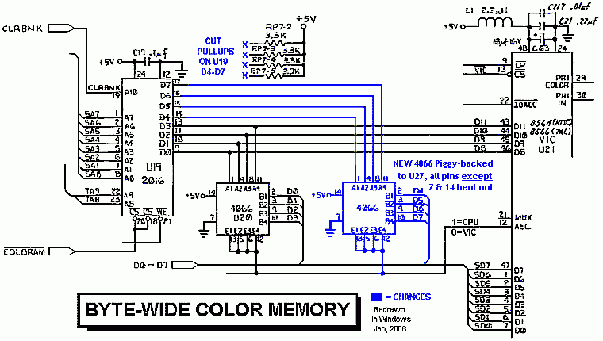
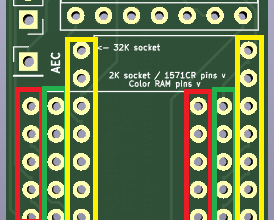
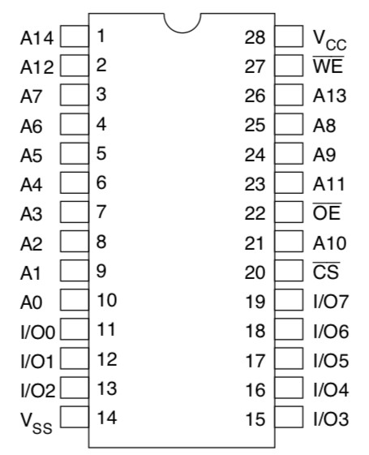
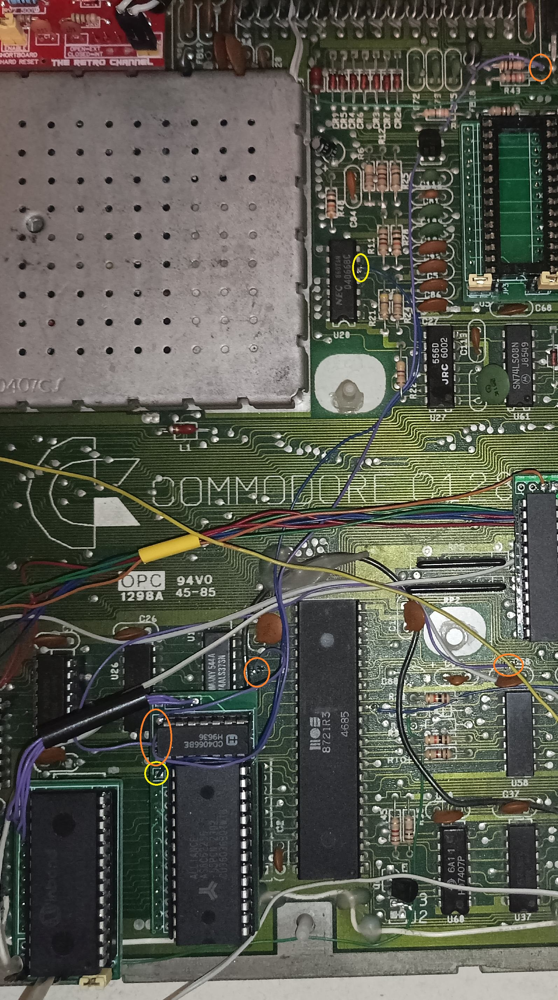
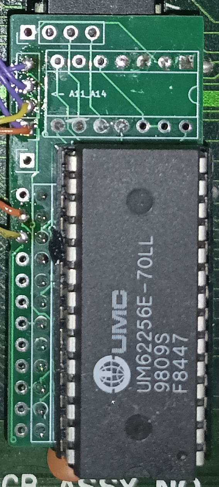
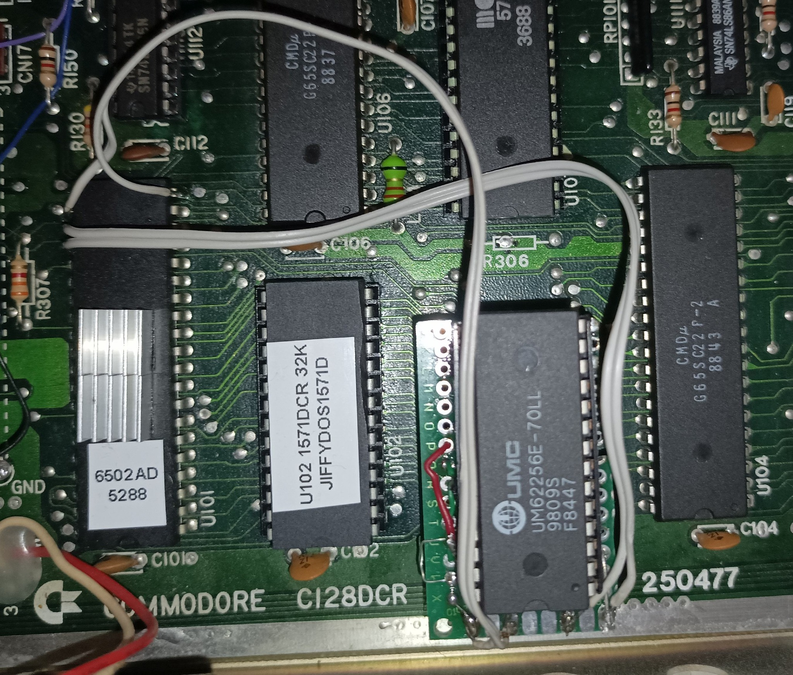
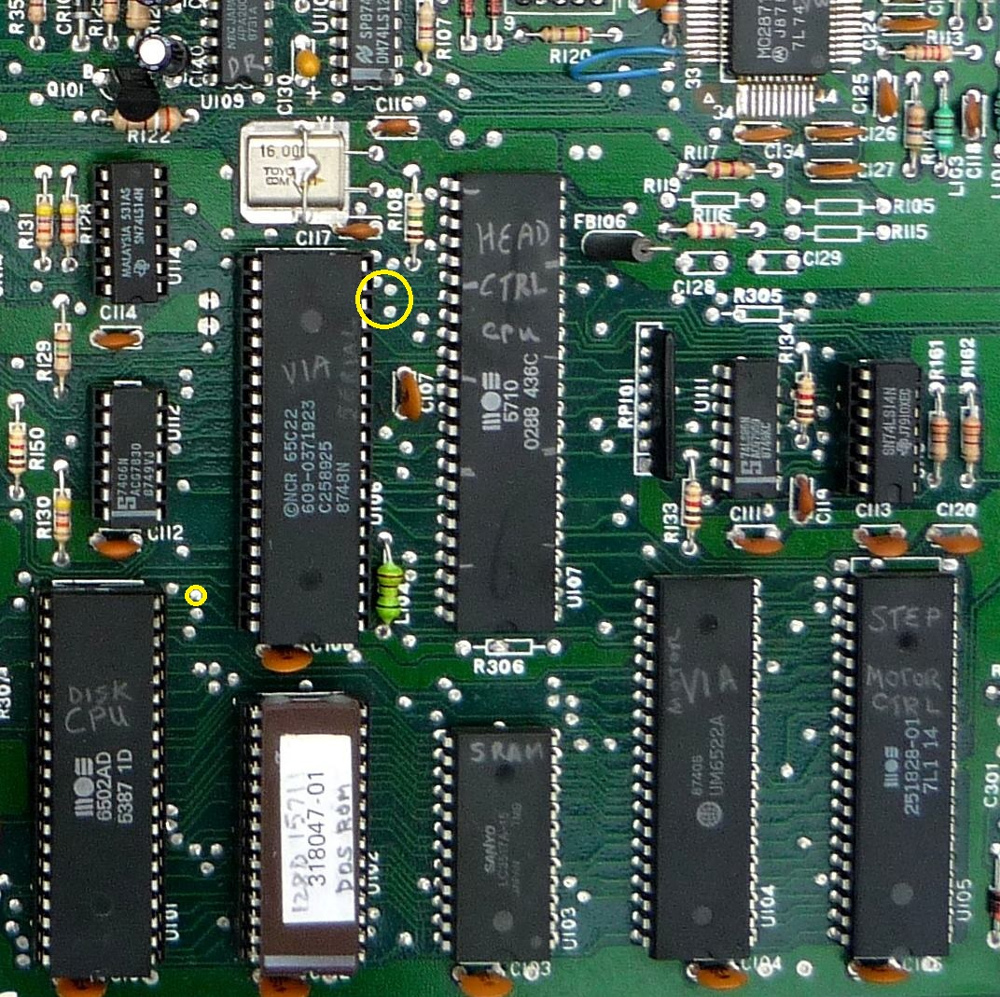
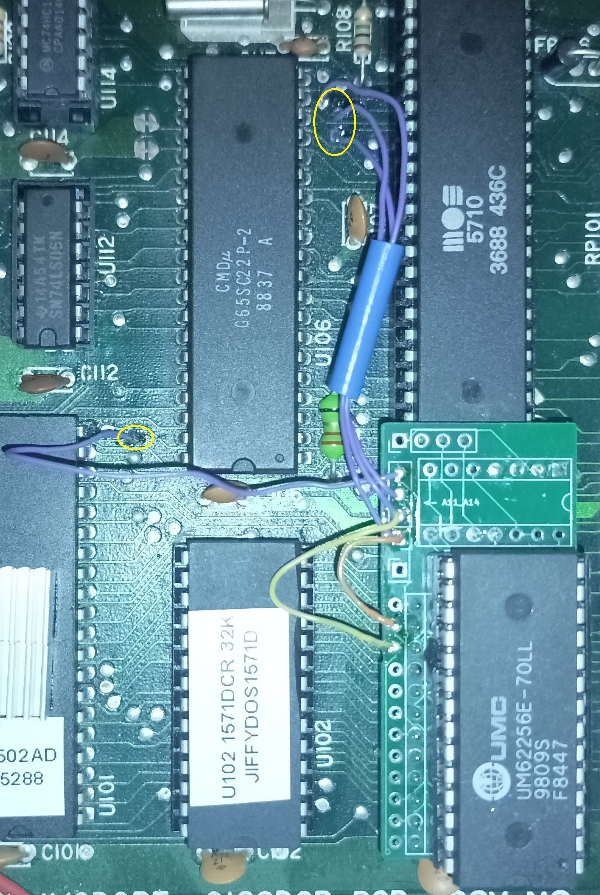

# C128 8-bit Color RAM and C128DCR 1571CR RAM expansion

This is a 24 to 28 pin adapter PCB that can be used for three different C128 modifications:

- widen 2K Color RAM to 8 bits (C128/C128D/C128DCR)
- widen Color RAM to 8 bits and expand to 32K (C128/C128/C128DCR)
- RAM Expansion for 1571CR compatible with Maverick (C128DCR only)

## Schematic

PDF plot of [the schematic can be found here](kicad/plots/kicad-c128-byte-wide-color-ram.pdf).

[kicad](kicad/) folder contains all the KiCad 6.0 project files.

## PCB

[kicad/plots](kicad/plots) folder contains Gerber files for manufacturing a PCB for any of these projects.

# 8-bit Color RAM

## Background

The idea comes from [a project published in 1990](http://www.sdiy.org/richardc64/color/byte.html).

All C128 variations use 8x2K SRAM chip (2016) for Color RAM. Although RAM is 8-bit, only lower 4 bits are connected. Lines D4-D7 are pulled up by a resistor pack to 5V.
This project replicates part of the onboard circuit and adds a quad switch 4066 as a bidirectional buffer between higher 4 bits and CPU bus.
Like the onboard U20 (4066) it switches Color RAM on/off bus, depending on the state of AEC line.



## Why?

For sure it doesn't add any colors. However having 1K (2K in C128 mode) of additional RAM may be useful for some projects. It is compatible with any other expansion or cartidge.

## 32K option

Even more of that RAM? Possibilities are endless, but how to switch the banks?

VIC utilizes 1K of Color RAM, but C128 was equipped with double of that amount to support split screen multicolor graphics in BASIC. The bank switching between lower 1K and upper 1K is done using CPU port at location $01.
In C64 mode this port decides about RAM/ROM configuration, in C128 mode lower two bits determine which half of 2K Color RAM is seen by VIC and which half by CPU.

It only made sense to me to extend this further and use other $01 port bits to provide more address lines for 32K Color RAM expansion. None of my C128s will be ever used with tape (or even TapeCart), so I connected A11-13 lines to
lines normally used by tape motor control, tape write and sense bits. This provides 13 bits of address, so 16K total.

You don't need to connect all of them or you can skip it altogether. I have reused connections to onboard pull-up resistors to pull these address lines high if nothing is connecte to the solder pads.

Until I have a better idea where to connect A14 I will be happy with using 16K of that RAM. That's enough for 16 full screens: 8 for imaginary FLI mode with color ram switched every line and another 8 for interlaced option.

## Assembly

Parts needed:

- 24-pin socket to be soldered in place of removed U19
- two sets of 24 round pins
- 4066 analog quad switch and 14-pin socket for it
- 24-pin socket for 2K SRAM (2016) *or* 28-pin socket for 32K SRAM (62256)
- 8x2K RAM (ideally 2016 desoldered from the board) *or* 8x32K SRAM (62256)

In any case you need to remove or desolder the original 2K chip (U19) and replace it by a 24-pin socket. PCB is meant to be equipped with round pins and plugged into that socket.
We also need some signals from the board, so additional wires will be needed.

Start assembly by soldering in two rows of 24 round pins that will be used to plug in PCB to the C128/D/DCR mainboard.
For this project you need to solder them in the row of holes closest to the PCB edge and the one marked on silkscreen, on the image below marked by RED.



For 2K option solder the 24-pin socket in holes marked GREEN. For 32K option solder 28-pin socket in holes marked YELLOW.

The last step of the assembly is soldering in 14-pin socket for 4066.

## Installation

Once the assembled PCB is plugged into place of original SRAM (U19) (*mind the orientation*) you need to connect five additional wires to the mainboard:

- connect AEC from onboard U20 (4066) any pin 5, 6, 12 or 13 - they are all connected together
- connect D4-D7 in any order from charset ROM nearby or from convenient vias. You may have 24 or 28-pin ROM there, so check the pinout and verify against e.g. CPU



D4-D7 lines are on the right bottom end of the chip.

**Note:** if you don't have 2K SRAM chip or it was damaged during desoldering you can just pop in 32K SRAM chip (still available these days) and stop here.
If you look on the schematics I have routed onboard D4-D7 lines (pulled high by onboard resistors) to A11-A14 lines.
So if you don't connect there anything at all they will be driven high and even with 32K SRAM those 2K of Color RAM will be available with no extra connections.

## Installation (32K Color RAM)

- connect A11/A12/A13 to CPU tape ports P3/P4/P5 from CPU socket (pins 27/26/25) or from convenient vias

Like with data lines it doesn't really matter in which order you connect those tape motor/write/sense connections to solder points A11-A14 lines or even if you leave A11 or A14 unconnected.

I wanted to avoid soldering directly to CPU (or underneath CPU) even though I have it already socketed. Instead I found several vias for convenient access.

For C128/C128D I found it invaluable to open [C128 Neo project in KiCad](https://github.com/jgrip/open128) and highlight ports and their net (using `` key) to see where they cross the board sides.

Here is how it can look like on C128D. It's already a mess off wires on that machine but you get the general idea:



- YELLOW points show AEC connection to U20
- ORANGE points show A11/A12/A13 connections to two vias and one side of R4 resistor
- A14 is not connected to anything
- data lines D4-D7 are connected to character ROM adapter nearby

## Testing

In C128 mode in monitor try:

```
M FD800 FD8080
```

then edit some values and try issuing the command again. You should see that the top four bits (first hex digit) hold their value.

## Testing (32K Color RAM)

Extra address lines are controlled by CPU port. First let's switch them all to output (as tape sense is an input by default):

```
POKE 0, PEEK(0) OR (8+16+32)
```

Then try to put some colored text on screen and switch RAM banks back and forth by using various combinations of bits 3, 4 and 5

```
X = PEEK(1) AND 199
POKE 1, X
POKE 1, X OR 8
POKE 1, X OR (8+16)
POKE 1, X OR 32
...
```

# 1571CR RAM expansion

## Background

Since I already had this PCB, which also does 2K (24 pin) to 32K (28 pin) conversion I had a closer look on the second 2016 2K SRAM chip present on C128DCR board.

This is 1571 RAM. In standard configuration there are exactly 2K of SRAM in range $0000-$07FF, just like on 1541.

There are [several projects that expand RAM on external 1571 and 1541s](http://d81.de/CLD-RAMBOard/References.shtml), but I couldn't find anything for 1571CR (internal 1571 of C128DCR).

I found a [memory map on zimmers.net](http://www.zimmers.net/anonftp/pub/cbm/schematics/drives/new/1571/memorymap.txt)
that described $6000-$7FFF range as "RAM shadows", so I conducted an experiment.

I have removed U103 (2016 2K SRAM) and put in this place a 24 to 28 pin adapter for 62256 (32K SRAM) and I connected A11-A14 directly to U101 (6502 CPU).
It worked right away with no extra parts. I was able to copy disks with Maverick v5 RAMBoard nibbler.

After more testing I saw that RAM is actualy present also in $0800-$0FFF range. In both $0000-$0FFF and $6000-$7FFF ranges that provides a total of 12K available.

## Why?

The only purpose seems to be [Maverick v5 RAMBoard nibbler](https://csdb.dk/release/?id=18107). [DolphinDOS uses extra memory](https://e4aws.silverdr.com/projects/dolphindos3/) but there is no way to add a parallel port to 1571CR in a way DolphinDOS expects - all these VIA port lines are
already used.

In Maverick to go 'GCR Nibbler' option and choose 'RAMBoard'. In further settings choose $6000-$7FFF area for RAM.

## Assembly

Parts needed:

- 24-pin socket to be soldered in place of removed U103
- two sets of 24 round pins
- 28-pin socket for 32K SRAM (62256)
- 8x32K SRAM (62256)

You need to remove or desolder the original 2K chip (U103) and replace it by a 24-pin socket. PCB is meant to be equipped with round pins and plugged into that socket.
We also need some signals from the board, so additional wires will be needed.

Start assembly by soldering in two rows of 24 round pins that will be used to plug in PCB to the C128DCR mainboard.

For this project you need to leave RED holes unoccupied and solder round pins in the middle row of holes from the PCB edge, on the image below marked by GREEN.


Solder 28-pin socket in holes marked YELLOW. You don't need to do anything about 14-pin 4066 either, that won't be used.

Here is how it looks like. Don't mind the orange and yellow wires. These are jumpers that I missed to route in the first version of the board. Current project has it already fixed.



## Installation

Once the assembled PCB is plugged into place of original SRAM (U103) (*mind the orientation*) you need to connect four additional wires to the mainboard: the new address lines.

In the prototype I soldered them directly to the CPU (U101), but I don't like this solution in the long run:



There are four vias where these address lines can be found:





## Testing

You can use test program from [RAMBOard test/demo disk](media/ramboard.zip) (cached from http://d81.de/CLD-RAMBOard/refs/ramboard.zip). For whatever reason the test program works but disk copier doesn't.

If you have JiffyDOS, it's easy to use JiffyMon in C64 mode. It can be [downloaded from CSDB](https://csdb.dk/release/?id=16906) with [PDF manual available here](http://slark.me/c64-downloads/jiffymon-machine-language-monitor-users-guide.pdf)

Commands with asterisk will act on the default drive memory, like:
```
M* 6000 6080
```
or copy data between C128 and the drive - from range $6000-$6080 to $0400 (top of screen):
```
MR 6000 6080 0400
```
and back from computer to the drive:
```
MW 0400 0480 6000
```

Restart monitor with
```
SYS 64715
```

For actual disk copying get Maverick V5 and after choosing GCR Nibbler select RAMBOard option. Then set it up for RAM that starts at $6000.
